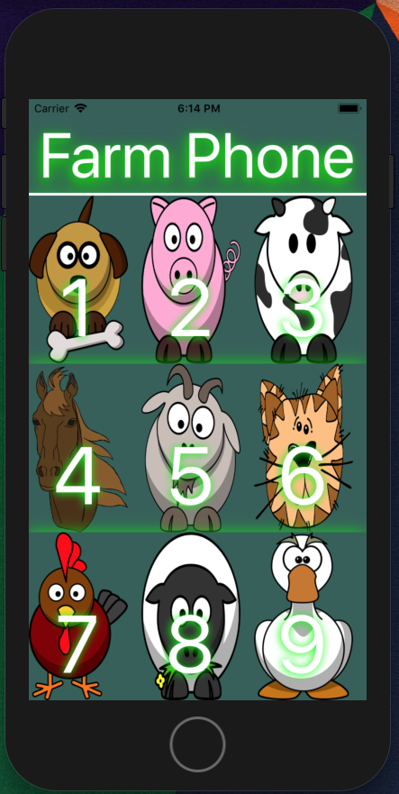

## Farm Phone

This is a react native mobile app that plays farm animal noises when you press on the animal's number.

### Local Setup Instructions

• In the directory where you want to save the project run
`git clone https://github.com/Anoble25/FarmPhone.git`

• Change to the project directory with
`cd FarmPhone`

• Install packages with
`npm i`

• Start the project with
`npm run start`

• After the server starts follow the directions to launch an emulator or connect to a physical device.
